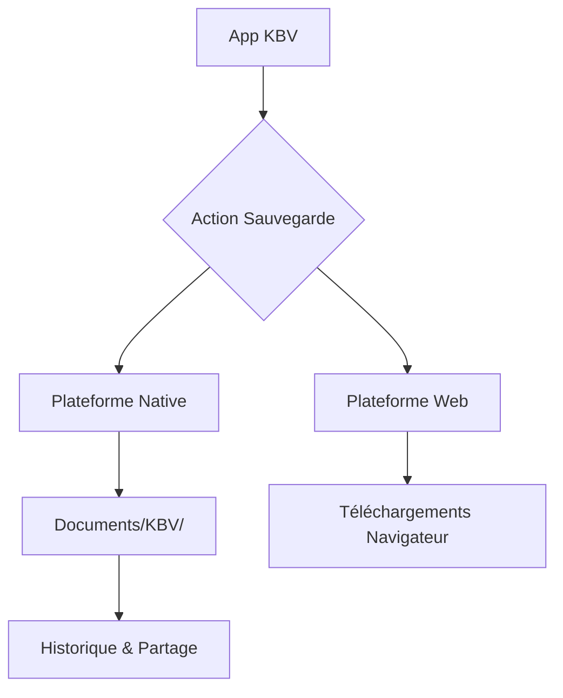

# 🏛️ Centre de Documentation et Historique - KBV Lyon

Ce document est la source unique de vérité regroupant tous les guides, l'historique des modifications et les rapports de vérification du projet.

---

## 📑 Sommaire Général
1. [Guides Utilisateur (Sauvegarde Samsung)](#-guides-utilisateur-sauvegarde-samsung)
2. [Résumé Visuel des Fonctionnalités](#-résumé-visuel-des-fonctionnalités)
3. [Historique des Actions et Chronologie](#-historique-des-actions-et-chronologie)
4. [Gestion des Traductions (KEA/PT)](#-gestion-des-traductions-kea-pt)
5. [Configuration Technologique et Android](#-configuration-technologique-et-android)

---

## 📖 Guides Utilisateur (Sauvegarde Samsung)
*Référence : DOCUMENTATION_SAUVEGARDE_COMPLETE.md*

### 🎯 Vue d'Ensemble
Le système de sauvegarde a été réorganisé pour utiliser le dossier **Documents/KBV/** sur les appareils Samsung (Tab S10 Ultra), facilitant la gestion et le partage des fichiers.

### ⚡ Démarrage Rapide
1. **Installation** : Lancer `install-sauvegarde.bat`.
2. **Déploiement** : Ouvrir Android Studio (`npx cap open android`), Clean, Rebuild, et Run.
3. **Usage** : Paramètres → Export & Import → Sauvegardes → Créer.

---

## 🎨 Résumé Visuel des Fonctionnalités
*Référence : RESUME_VISUEL.md*

### Flux de Sauvegarde

---

## 📊 Historique des Actions et Chronologie
*Référence : PROJECT_ACTIONS_SUMMARY.md*

### État Global
- **Actions accomplies** : 200+ (Nettoyage, Refactorisation Planning, Migration Sauvegardes).
- **Refactorisation Planning** : Intégration des actions "Annuler", "Remplacer" et "Conflits" avec navigation par état.
- **Migration FileSystem** : Bascule de l'API de téléchargement standard vers Capacitor Filesystem pour Android.

---

## 🌍 Gestion des Traductions (KEA/PT)
*Référence : VERIFICATION_TRADUCTIONS.md*

### ✅ Corrections Apportées
- **Capverdien (KEA)** : Correction des orthographes (`kongregason`), accents (`Jeová`) et suppression du mélange avec le Portugais.
- **Portugais (PT)** : Harmonisation des termes (`discurso edificante`, `cordialmente`).

---

## ⚙️ Configuration Technologique et Android

### Configuration Vite
Le fichier `vite.config.ts` a été optimisé pour le splitting de bundle (React-vendor, UI-vendor, Data-vendor).

### Déploiement Android
- **AndroidManifest.xml** : Permissions `READ_EXTERNAL_STORAGE`, `WRITE_EXTERNAL_STORAGE` et API 33+ Media.
- **Android Studio** : Nécessite Gradle 8.0+ et le mode développeur activé sur la tablette.

---

**Version** : 1.25.0  
**Dernière mise à jour** : Janvier 2026  
**Développé pour l'Église Baptiste de Lyon**
